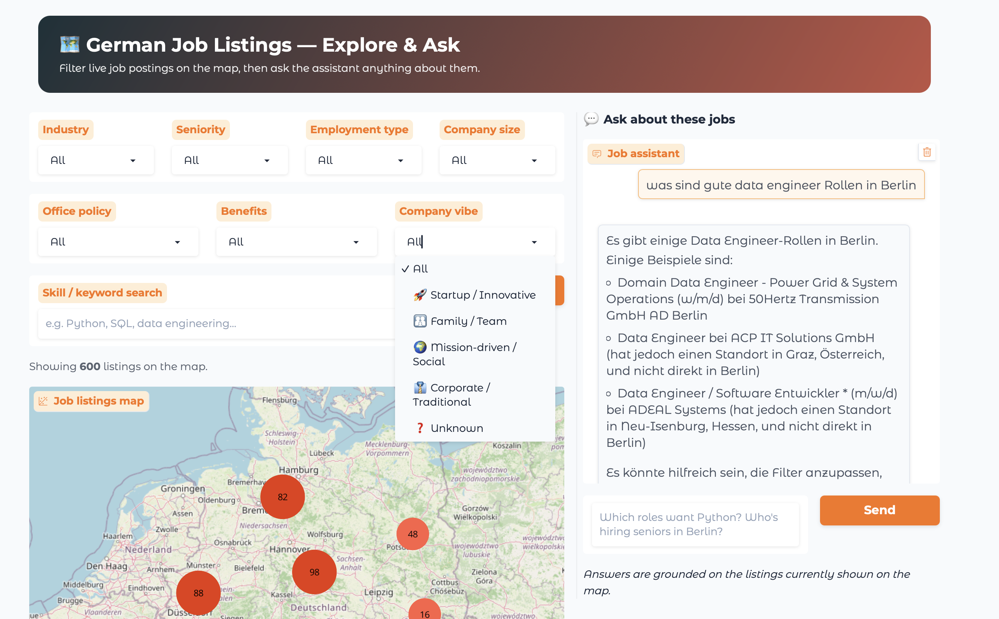

# Apply-Agent

An end-to-end **AI job-exploration app** on Databricks. It ingests thousands of live
German job listings, enriches them with LLM-derived attributes, and serves an
interactive **map + chat** experience: filter jobs across Germany by clean,
emoji-labeled categories, then ask a grounded assistant anything about the listings
currently on screen — all backed by a medallion Delta pipeline, Mosaic AI Vector
Search, and Foundation Model APIs, deployed as a Databricks App.



---

## What the app does

The frontend (`src/app/main.py`, a Gradio Blocks app) is a single page with two panels:

**Left — an interactive map of German job listings.**
- Filter by seven attributes, each collapsed into a small set of **emoji-labeled
  buckets** (3–5 choices): Industry, Seniority, Employment type, Company size, Office
  policy, Benefits, and Company vibe — plus a free-text skill/keyword search.
- The map (Plotly, OpenStreetMap tiles — no Mapbox token) **clusters** nearby markers
  so hundreds of results stay legible, and zooming breaks clusters into individual
  points.
- Every listing has a location: coordinates come from an offline geocode lookup, an
  LLM-inferred city fallback, or a jittered country centroid, so nothing is dropped.
- A results table under the map lists each job with its attributes and a clickable
  **"View job"** link to the original posting.
- Filtering re-queries the SQL warehouse and redraws the map + table; the first paint
  loads a fast subset and "Apply filters" pulls the full set.

**Right — a chat assistant grounded on the visible listings.**
See [Chat assistant](#chat-assistant-grounded-qa) below.

## Chat assistant (grounded Q&A)

The chat box (`src/app/chat_handler.py`) lets you ask free-text questions about the
jobs **currently shown on the map** — e.g. *"which roles want Python?"*, *"who's
hiring seniors in Berlin?"*, or *"was sind gute Data-Engineer-Rollen in Berlin?"* (it
answers in the user's language). The question plus a compact summary of the filtered
listings is sent to a Foundation Model (Llama 3.3 70B) via the OpenAI-compatible
client, so answers are **grounded on exactly what you're looking at** — it references
real companies and job titles, and suggests adjusting the filters when there's no
match rather than inventing listings. Change the filters and the assistant's context
changes with them.

## Layout

```
notebooks/   Ordered pipeline (00 setup → 02 ingest → 03 enrich → 04 index → 06 tools → 07 deploy)
src/agent/   CV parser, location resolver, matching agent (used by the pipeline tools)
src/app/     Gradio map + chat frontend (job-agent-app): main · listings_loader · map_figure · chat_handler
src/pipelines/  Enrichment state machine, embedding, attribute normalization (emoji buckets, geocode fallback)
src/models/  Dataclasses & Delta table schemas
src/utils/   Validation, retry/backoff, haversine, checkpoints, deployment gate
resources/   Bundle resource definitions (jobs, app, vector search, grants)
tests/       unit · property (Hypothesis) · integration (live Databricks)
```

## How the data is ingested — a medallion pipeline


The listings corpus is built through Bronze → Silver → Gold Delta tables in Unity
Catalog, one ordered notebook per stage (`notebooks/02`–`07`), and refreshed **daily**
on a scheduled Databricks job:

**Bronze — ingest (`02_ingest_listings.py`).**
Fetches live postings from the **German Federal Employment Agency (Bundesagentur für
Arbeit) Jobsuche API**, paginating within the API's real constraints (page size ≤ 500,
10 000-record window) across multiple search queries to gather **10k+ unique
listings**. Job descriptions are fetched per listing (toggleable) so the enrichment
LLM has real text to reason over. If the API is unreachable it falls back to a bundled
dataset. Records are validated, batched, and **MERGE-upserted** into
`bronze.job_listings` keyed on `source_url`, preserving the original `listing_id` on
updates. Bad rows go to `bronze.ingestion_errors`; a checkpoint is written after each
batch so a restarted run resumes cleanly.

**Silver — enrich (`03_enrich_listings.py`).**
Reads `unenriched` Bronze rows and:
- resolves `location_text` → lat/lon via an **offline geocode join**, with an
  **LLM-inferred city fallback** and a jittered centroid so *every* listing is
  mappable,
- derives structured attributes from the free-text description using a Foundation
  Model — the classic five (`required_skills`, `seniority_level`, `employment_type`,
  `industry`, `company_size_band`) plus three **LLM "vibe" attributes** not present in
  the source data: `company_vibe`, `office_policy`, and `benefits_rating`,
- **standardizes every filterable attribute into fixed, emoji-labeled buckets**
  (`src/pipelines/attribute_normalization.py`) so the app's filters stay to 3–5 clean
  choices,
- **adapts LLM strategy to batch size**: server-side `ai_query` SQL for large batches
  (> 50 records), per-record SDK calls otherwise,
- builds and chunks an `embedding_text` field,
- runs an explicit enrichment **state machine**, checkpointing after every batch.

Output lands in `silver.enriched_listings` and `silver.enriched_listings_chunks`.

**Index — embed (`04_sync_vector_index.py`).**
Creates a **Mosaic AI Vector Search** endpoint and a Delta Sync index over the chunks,
embedding `embedding_text` with `databricks-gte-large-en`. Creation and sync are
idempotent; a failed sync retains the last good index rather than clearing it.

**Gold — expose retrieval as tools (`06_create_uc_functions.py`).**
Four **Unity Catalog functions** become reusable, governed tools:
- `search_listings` — semantic search over the vector index (capped at 200),
- `compute_commute_distance` — haversine great-circle distance in km,
- `get_user_profile` — reads the candidate profile,
- `draft_application` — generates a tailored cover letter via Foundation Model APIs.

**Serve — deploy (`07_register_deploy_agent.py`).**
The `MatchingAgent` (`ResponsesAgent` interface) is logged with MLflow and deployed to
a Model Serving endpoint.

```
Jobsuche API ─▶ bronze.job_listings ─▶ silver.enriched_listings(_chunks)
   (fallback)        (MERGE upsert)     (geo-join + LLM city fallback
                                          + attribute enrich + emoji buckets + chunk)
                                                   │
                                                   ▼
                                        Vector Search index (gte-large-en)
                                                   │
                     ┌─────────────────────────────┴───────────────┐
                     ▼                                              ▼
        Map + filters (Plotly, clustered)              Chat assistant (grounded
        reads silver via SQL warehouse                 on the visible listings)
```


